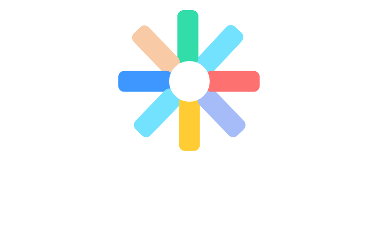
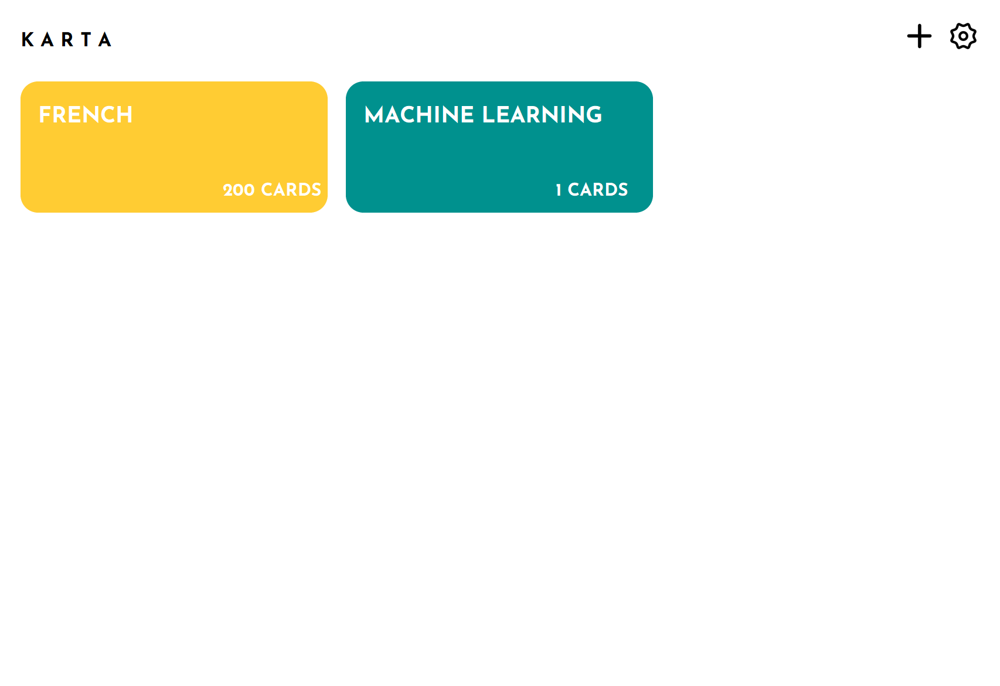
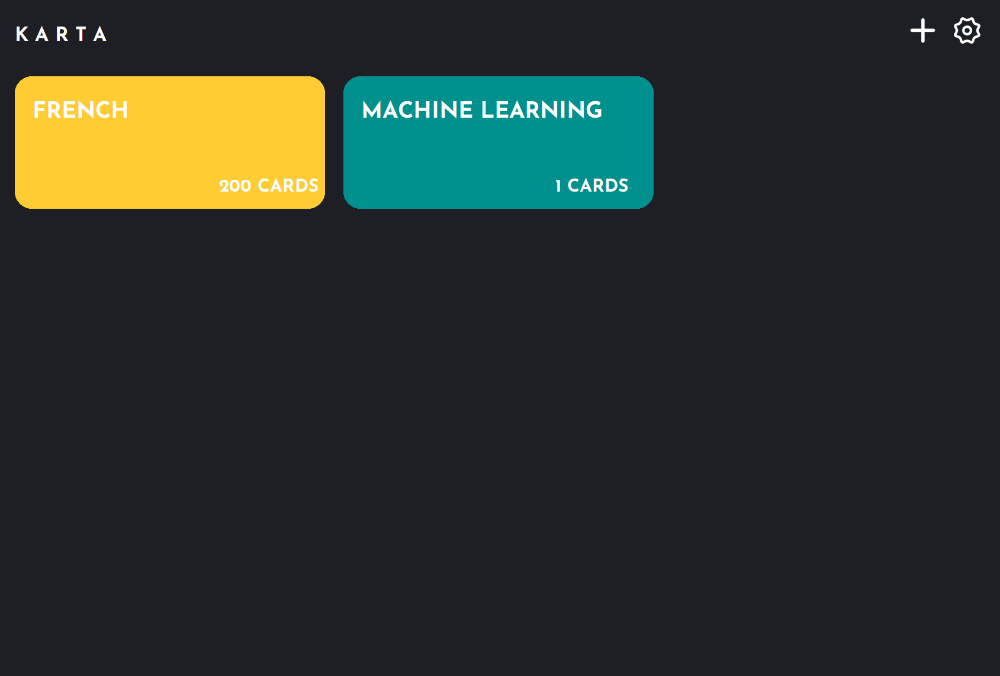
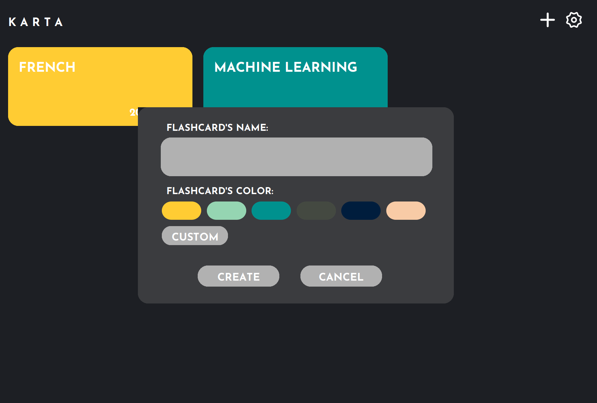
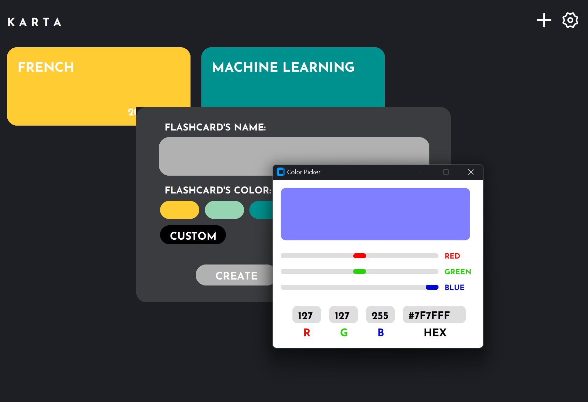
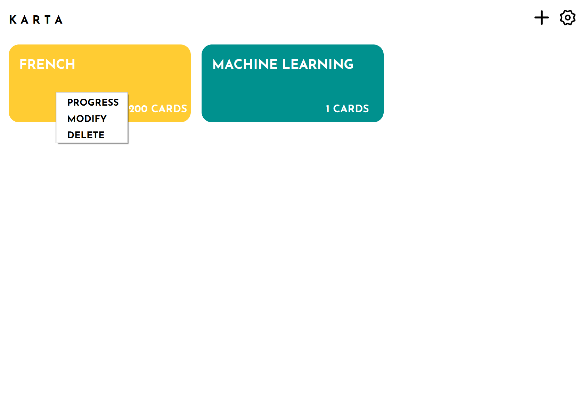
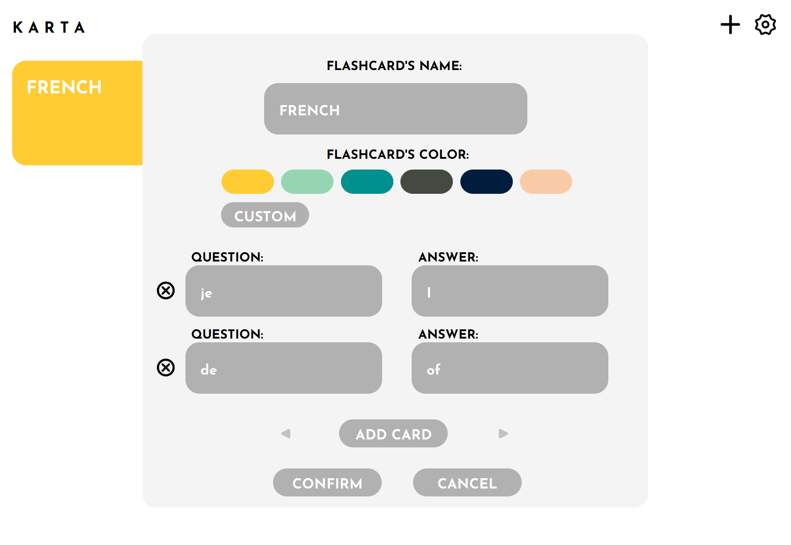
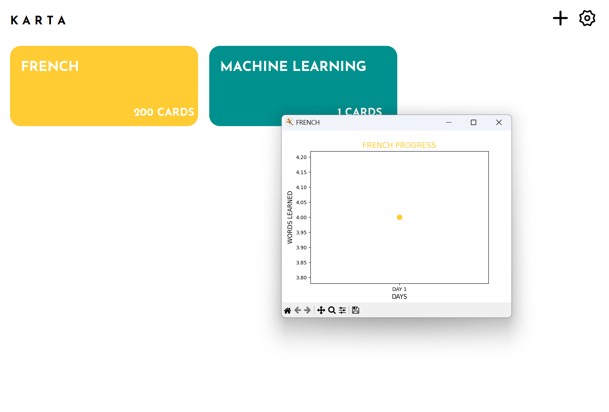
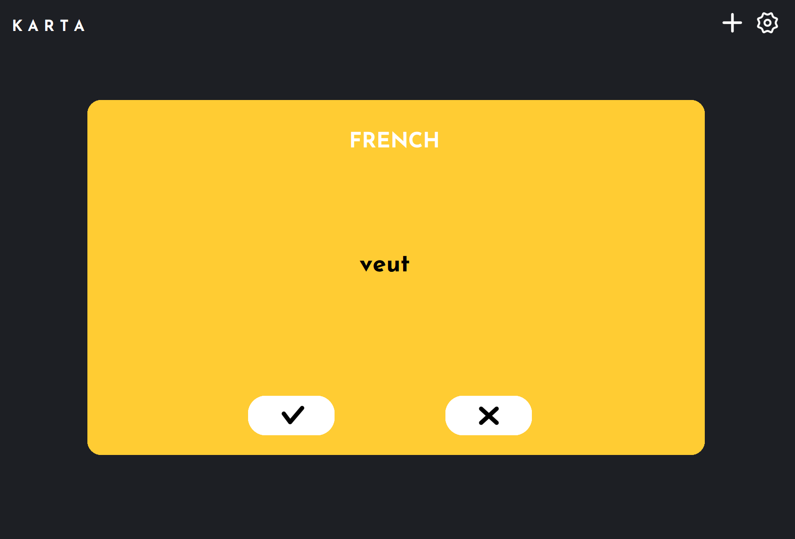

A Flashcards' Desktop App.

### Project's Name: KARTA
### Developers: 
- Mohamed Amine Layachi
- Omaima Binan
- Wissal Ramchi
  
### Dev Started: 08/02/2023
### Dev Ended: 25/02/2023

### Context:
This project was developed as an assessment for our Python Course.

### Tools Used:
- Adobe XD for UI/UX
- Pycharm for Coding

### Libraries used:
- Customtkinter for UI (Hybrid use together with Tkinter).
- Pillow for Image Management.
- Pandas, json (& numpy) for file management.
- Matplotlib for progress saving.

### Font Used:
Josefin Sans (if you want to see the app as it was made, then this font is a MUST)
#### NB: You can find it inside the assets folder (The compressed file).

## Notes:
- The development of this project has ended on the stated date above. Therefore, improvements won't be made in the future.
- In the optimization context, the app is fast with low memory consumption. However, it can be improved further with the use of multiprocessing techniques.
- The app's code is heavily customized and there are lots of functions that are specific to it. Thus, if you use them, they might not be able to offer you what you seek.
- You will find some duplicated methods here and there. We made it that way because we didn't see any reason for the app to get a scalable code. Moreover, it was a little bit late to redo everything.
- The code is not documented. However, you can use [KARTA - The Little Manual](https://drive.google.com/file/d/102DFhfXxpwKjSLJFRNN305Mlw1j9_4Cs/view?usp=sharing) to figure out the purpose of some features. Also, it is fairly simple to understand what certain methods do.
- In case of any questions, contact me.
### Screenshots:

